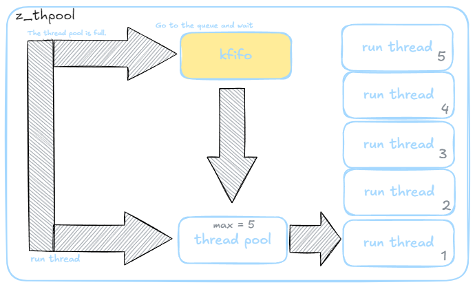

<div align="center">
  
  <h1>z_thpool</h1>
  <span>English | <a href="./README.zh-CN.md">中文</a></span>
</div>

<div align="center">
  <br/>
  <a href="" target="_blank"></a>
</div>

## ⚡ Introduction

**This is a simple Linux thread pool.** 😊

## 💻 Diagram
The internal structure consists of a thread pool and a circular queue. When the thread pool is full, new tasks will be placed in the circular queue. Once a thread exits, it will fetch a task from the queue for processing.
<div align="center">
  
</div>

## 🚀 How to use?

**The following operations are based on the root directory of the current project, please ensure to perform them correctly!**

### **Compile**

```bash
cd z_thpool
make
cd lib
ls
libtestlib.a  libz_thpool.a   // Compilation completed
```

### **Test**

#### Complete Test
```bash
 ./build/z_thpool_test 
Enter a command (type 'exit' to quit):
> help  // Enter help to view test commands

Enter a command (type 'exit' to quit):

start 5 100 64  # Start with 10 threads, 50 cache queues, set the thread stack size to 64k.
stop            # Stop. 
add 10          # Add 10 threads 
test            # Test thpool 
show            # Show thpool state 
help            # Help 
> test  // Enter test to check complete test situation
Starting thread pool extreme test...
[debug ][src/z_thpool.c:182, z_thpool_start] enter
[debug ][src/z_thpool.c:229, z_thpool_start] exit :0
Task 0 added successfully
...
Task 99 added successfully
Waiting...
Task 0 is being processed by thread 140675616458496
...
Task 99 is being processed by thread 140675609564928
Waiting...
Waiting...
Waiting...
Waiting...
Task 0 argument after processing: 0
...
Task 99 argument after processing: 99
Stopping thread pool
Thread pool stopped
Thread pool extreme test completed.
```
#### Step-by-Step Test
```bash
./build/z_thpool_test 
Enter a command (type 'exit' to quit):
> start 5 100 64         // Create 5 threads in the thread pool, create 100 caches, each thread has 64K stack space
> add 100                // Add 100 threads
> show                   // View thread pool state
------------------------------------------------------------------------------------------------------------------------
| z_thpool module                                                                                                                                          
------------------------------------------------------------------------------------------------------------------------
Ver:               0.0.1.0
------------------------------------------------------------------------------------------------------------------------
max nums:          5     // Maximum threads is 5
create nums:       5     // Threads already created is 5
busy nums:         5     // Currently running threads is 5
max cache nums:    100   // Created cache queue is 100
use cache nums:    85    // Used 85, indicating 85 threads are waiting in the queue
pub_bytes:         1600
sub_bytes:         240
> show
------------------------------------------------------------------------------------------------------------------------
| z_thpool module                                                                                                                                          
------------------------------------------------------------------------------------------------------------------------
Ver:               0.0.1.0
------------------------------------------------------------------------------------------------------------------------
max nums:          5     // Maximum threads is 5
create nums:       5     // Threads already created is 5
busy nums:         5     // Currently running threads is 5
max cache nums:    100   // Created cache queue is 100
use cache nums:    85    // Used 80, indicating 80 threads are waiting in the queue. The number of tasks in the queue will gradually decrease as threads process them until it's empty.
pub_bytes:         1600
sub_bytes:         320
> 
```

### **Usage Functions**
Just three steps
```c
// Step 1: Start the thread pool
struct z_thpool_config_struct t_conftg;
t_conftg.max_thread_nums = 50;           // Maximum number of concurrently running threads is 50
t_conftg.msg_node_max = 1000;            // Maximum capacity of the cache queue is 1000 tasks
t_conftg.thread_stack_size = 64 * 1024;  // Stack size of each thread is 64KB
z_thpool_start(&t_conftg);

// Step 2: Add tasks to the thread pool
z_thpool_add_work(test_task_cb, &i);

// Step 3: Close the thread pool
// If you no longer need the thread pool, you can close it:
z_thpool_exit();
```
### **File Description**
The key files are only z_kfifo.c and z_thpool.c
```base
test.c      # Test program
z_kfifo.c   # Cache queue
z_thpool.c  # Thread pool implementation
z_debug.h   # Information toggle
z_tool.h    # Tool macros
z_table_print.c # Used by the test program's show command for convenient table printing
```

## 🛠️ About

## ❓ FAQ

## 🤝 Development Guide 

## 🚀 Star 
[](https://starchart.cc/BitStreamlet/z_thpool)

## 🌟 Contribution
Thanks to everyone who has contributed to z_thpool! 🎉
<a href="https://github.com//cuixueshe/earthworm/graphs/contributors"></a>

## 🌟 Acknowledgment
**Thank you for taking the time to read our project documentation.**
**If you find this project helpful, please support us with a Star. Thank you!**